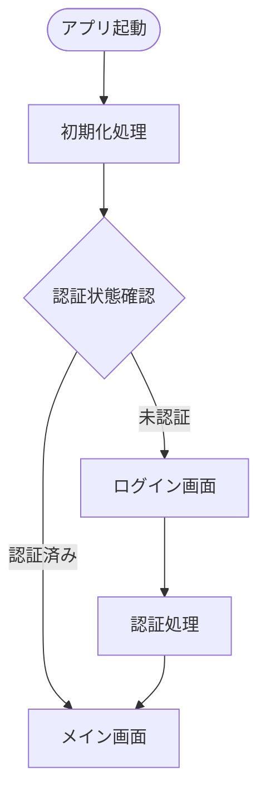
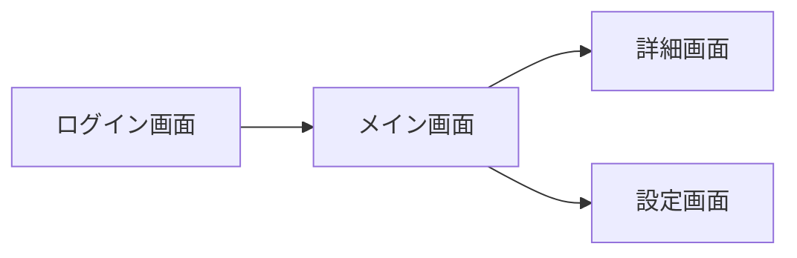
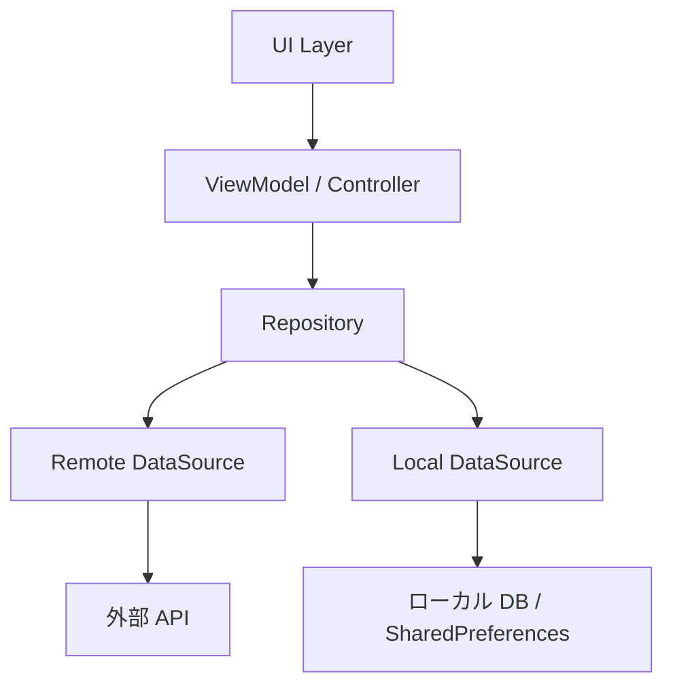

# System Flow

> **注意**: このドキュメントはシステム間の時系列的な繋がりを mermaid 図で表記します。
> `system_architecture.md` と同列に扱い、実装・変更のたびに必ず更新すること。

最終更新: 2026-04-26

---

## アプリ起動フロー

> 実装が進むにつれて更新すること。

---

## 画面遷移フロー

> 画面が増えるたびに追記すること。

---

## データフロー

> アーキテクチャが確定したら実際の構成に合わせて更新すること。

---

## 変更履歴

| 日付 | 変更内容 | 更新者 |
|------|---------|--------|
| 2026-04-26 | 初版作成（プレースホルダー） | Claude |
